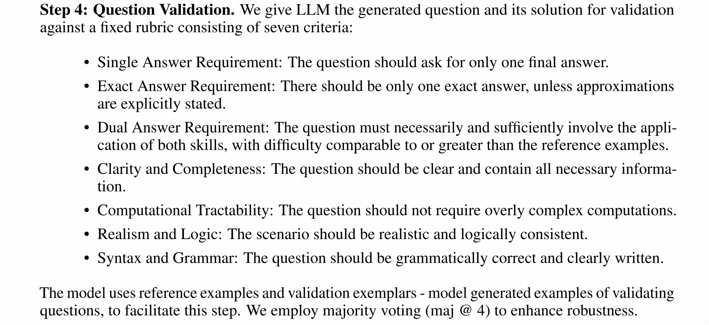

# Introduction
现在的大模型能力有些拟合了，对于旧版问题的适应性明显强于新版问题。

从知识点上构建问题存在以下问题：
- 与数据集中现有的问题过于相似
- 有错误或者无意义
- 对于人类太乏味或者机械（循环次数太多）
- 他们无法解决这些问题
  
# Method
大模型从知识点上构建问题，人类专家选取问题。
它在prompt中给出了几轮人类和AI的conversion，应该可以让大模型了解这个问题的难度和避免生成一些类似的情况。

技能配对验证、问题生成、solution尝试、问题验证（根据规则验证）

几轮prompt之后再由人工筛选。

有66.19%的比例被人类注释者修改过。