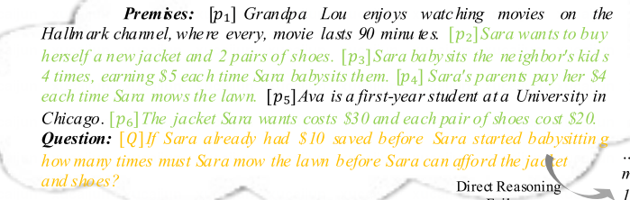
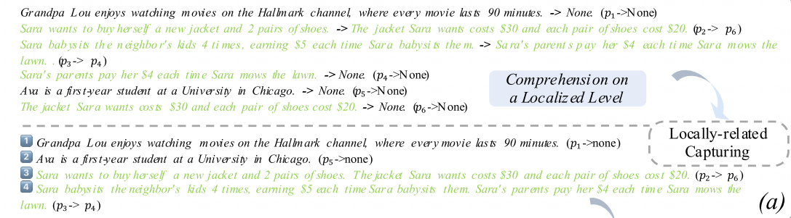
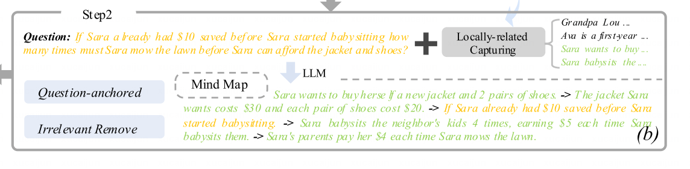
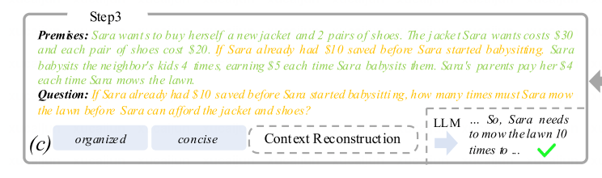
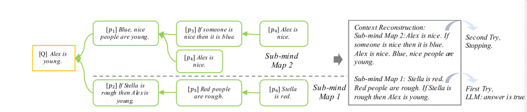

# Introduction
前提顺序和中间推理步骤所需的上下文不一致时大语言模型的性能会严重下降。
探索了一下对推理影响的内容，有三个现象：
- 从复杂信息中很难找到切入口
- 当前步骤高度关注前一个步骤，甚至可能会编一个不存在的前提。
- 不相关信息很可能会导致大模型分心。

在规定的前提中捕获最相关的前提片段，使用问题作为anchor去集成第一步生成的前提片段，创建树形思维导图，以有序的方式呈现全局信息。

大语言模型利用上述重构的信息，从思维导图中逐步有序的组织起来。

# related work
可以从这里获取一些其他论文。
SI and LAMBADA
# Saliency score analysis
信息流分析来动态识别令牌之间的关键交互。
和人类不同，无序和不相关的内容会显著降低大语言模型的表现。引入两种策略“Concise”和“Organized”以更好地激发大语言模型的推理能力。

# Approach
主要想重构context去降低模型推理的难度。

模拟认为处理复杂逻辑推理任务的能力，提出一种三阶段方法来解决混乱和分心问题。
- 试图根据其内部逻辑或语义关系去捕获与本地相关的前提，即将每个前提相关链接起来，形成一系列前提片段。
- 面对几个独立的部分，把整体系统化，以促进全局范围内的理解。以问题Q作为anchor去识别相关片段，整合到一个完整的树状思维导图。（能够以有序的方式呈现全局信息，并且抛弃了无关前提）
- 由思维导图去重构推理context。

##  local级别的捕捉
p_i -> p_j 表示 premise i 和 premise j的关系。
用prompt捕捉关系之间的内在联系。

## 生成思维导图
以问题Q为中心组织起来思维导图结构。

我认为应该时把问题中的假设也加入到条件序列中，并且识别出一条链。
## 根据思维导图（mind map）重构context

其实就是把思维导图的链变成premise，question不变。

如果有两个子思维导图，则分别生成，只要有一个能给出true的answer即可（一个问题可能能从两个完全不同的前提得到相同的答案？）