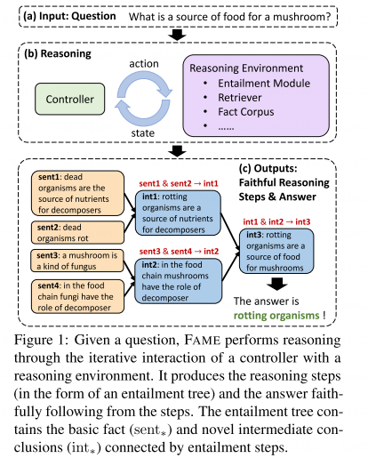

# Introduction
这篇论文集中在忠实推理，不仅答案要正确，过程也要正确。

这里展示的树形结构很类似于之前分解的condition工作。
# Task Defintion
有一个问题Q和一组候选选项O，期望输出是蕴含树形式的有效推理步骤T和答案O_a。蕴含树T由多前提步骤组成，叶节点sent+是从事实语料库中C选择的事实，中间节点（int+）是新的中间结论。

如果每个非叶节点都是其直接子节点的有效蕴含，则认为树是有效的。如果其根节点的结论支持选项O_a，则认为树是忠实的。

# Method
跟之前的方法一样，先转化成陈述性假设,尝试以正向链的方式为每个假设生成蕴含树.推理状态s={目标假设H,部分树Tp,一组句子X}
