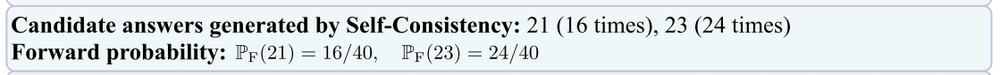

# Abstract
引入 backward 推理去验证候选答案

FOBAR，将前向推理和后向推理结合起来验证，在数学数据集和三个大模型上达到了比较好的性能。
# Introduction
自一致性（Self-Consistency）是一种简单有效的方法提高CoT。

使用温度采样，对一组不同的推理链可能会导致多个候选答案，选择得票最多的那个作为最终答案。
- 这篇文章中实验表示简单采样更多推理路径不会导致测试精度的提高。
- 应该使用更可靠的验证者。

使用反向推理验证答案
- 对于每个候选答案A，随机掩码一个问题中的数字为x，设计一个templete 如果答案是A,那么x的值是多少？
由于x已知，检测掩码x是否被正确预测。
- 一个正确答案比错误答案更可能帮助预测掩码x。
  
把 the vote of A定义为 成功预测出x值的链数（即A只为答案，对一个问题进行多次思维链推导），即估计出反向概率

同时结合上前向得到A的概率：

这就是使用自一致性（Self-Consistency）得到的前向概率

这是利用反向预测得到x值得概率，最后用超参数alpha调整这两种概率。

# Related Work
RCOT、MetaMath（使用Backward reasoning 去增强问题以进行微调）

# Method

## Forward reasoning
就是用多数投票的方法。

## Backward reasoning
用这样的templete

防止分母为0

## FOBAR (FOrward and BAckward Reasoning)
使用

这样的公式就不需要训练了。
## Extension to Non-Mathematical Tasks
把猜数值的方法改成让大模型给出一些问题中的关键word，然后猜word。

# Experiment
CoT or ComplexCoT