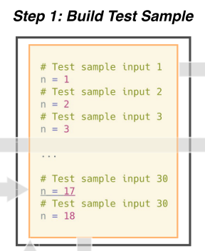
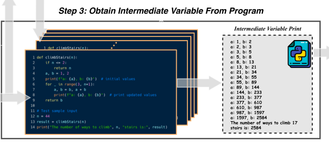
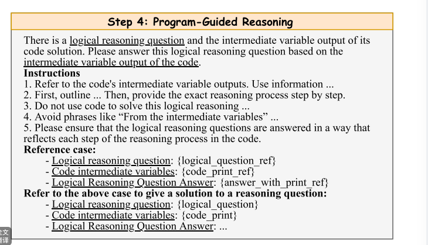

# Abstract
通过算法题和代码解决方案构建不同的初始样本。然后根据算法问题和初始样本设计不同的复杂推理问题。

结合代码solution的中间变量和复杂推理问题，推导出推理过程和答案。由此构建了新的足够困难的数据集和由中间变量值指导的高质量推理。

# Introduction
合成的数学数据显著提高了模型的数学能力。现有的复杂逻辑的合成数据通常基于命题逻辑及其组合来构造的。

因此，这样的学习让大模型在复杂推理方面该机哪有闲，高质量推理过程是好的数据集的核心部分。

有使用蒙特卡洛树搜索的方式优化数学推理任务中的推理过程。

- 本文先基于算法问题和python代码构造多个input。
- 之后使用模型重写，通过结合不同的input与相应的问题语句生成逻辑推理问题。
- 接下来考虑input和代码solution来构造当前示例的解决方案，从代码中获得中间变量和最终结果。
- 通过整合问题称述和中间变量输出，推导出最终的推理路径。

# Approach
## step1 build test sample input
将问题和对应代码都提供给LLM，让模型生成适当的测试样本输入，单个响应30个，多次之后删除重复数据。

## step2 construct 复杂推理问题
使用问题和input作为prompt。这里就是用上下文学习的方式把input带入到问题中，形成一个推理问题。
## step3 从程序中获取中间变量
以对应代码和输入作为prompt，提示模型重写原始代码，以适应测试样本输入，并且打印关键的中间变量。

就是改写代码，多加一些打印。

##step4 Programing-guided 推理
参考构造的推理问题和代码的中间变量输出，得到一个对于这个推理问题的逻辑解。

这里采用GPT4构造一个初始reference case，然后使用开源模型得到结果。
