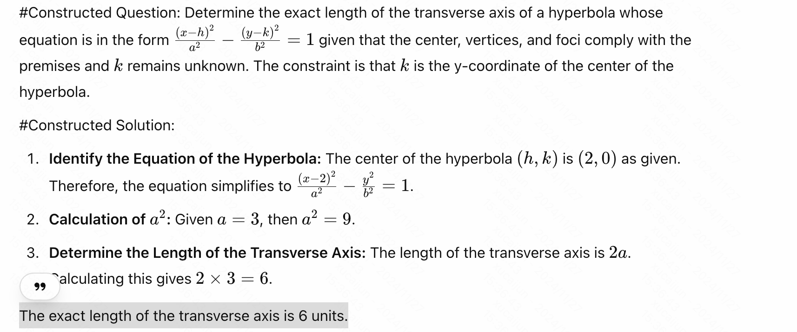
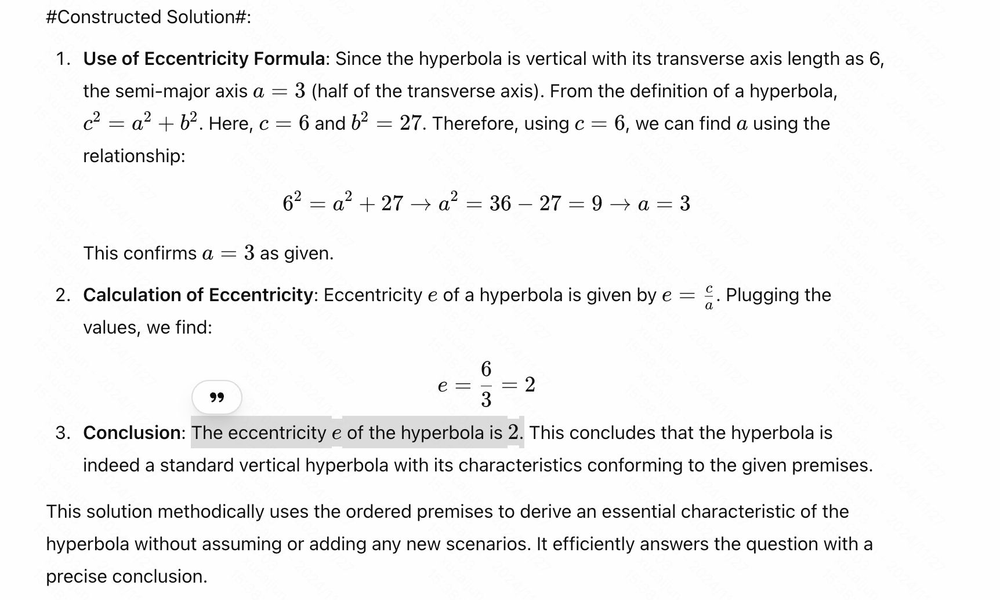
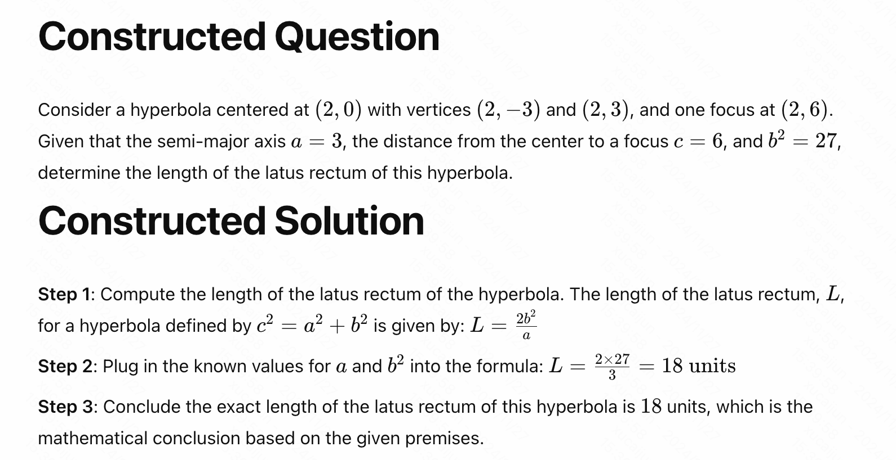
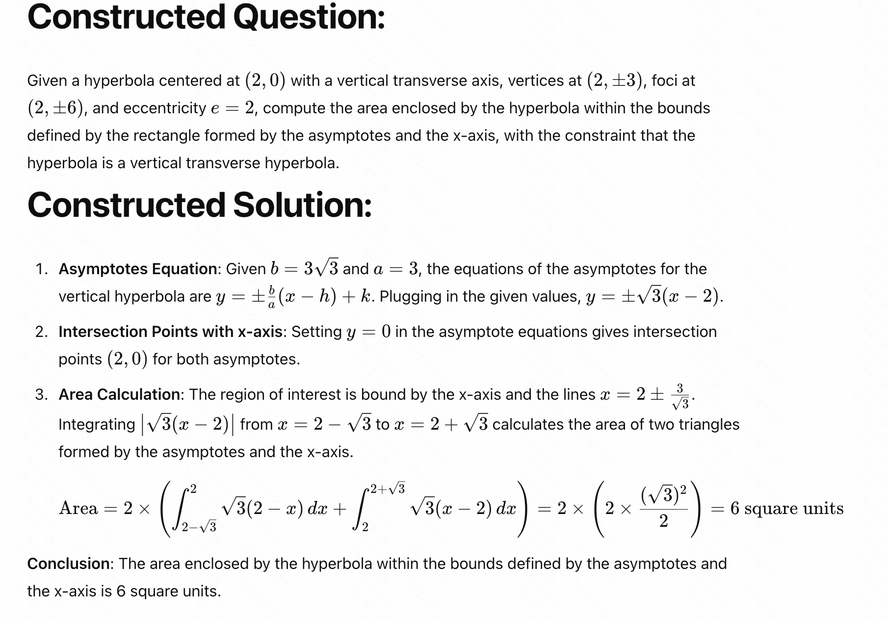

# 原问题
"problem": "In a certain hyperbola, the center is at $(2,0),$ one focus is at $(2,6),$ and one vertex is at $(2,-3).$  The equation of this hyperbola can be written as\n\\[\\frac{(y - k)^2}{a^2} - \\frac{(x - h)^2}{b^2} = 1.\\]Find $h + k + a + b.$",
"level": "Level 3",
"type": "Intermediate Algebra",
"solution": "The center of the hyperbola is $(h,k) = (2,0).$  The distance between the center and one vertex is $a = 3,$ and the distance between the center and one focus is $c = 6.$  Then $b^2 = c^2 - a^2 = 6^2 - 3^2 = 27,$ so $b = 3 \\sqrt{3}.$\n\nTherefore, $h + k + a + b = 2 + 0 + 3 + 3 \\sqrt{3} = \\boxed{3 \\sqrt{3} + 5}.$"

# Extract 

[
    "The center of the hyperbola is at $(2,0)$.",
    "One focus of the hyperbola is at $(2,6)$.",
    "One vertex of the hyperbola is at $(2,-3)$.",
    "The equation of the hyperbola is \\[\\frac{(y - k)^2}{a^2} - \\frac{(x - h)^2}{b^2} = 1.\\]"
]

"Find $h + k + a + b.$"

[
    {
        "premises": [
            "The center of the hyperbola is at $(2,0)$.",
            "One vertex of the hyperbola is at $(2,-3)$."
        ],
        "method": "Using the coordinates of the center $(h, k) = (2, 0)$ and the vertex at $(2, -3)$, calculate the distance $a$ as the absolute value of the difference in the y-coordinates.",
        "conclusion": "$a = 3$."
    },
    {
        "premises": [
            "The center of the hyperbola is at $(2,0)$.",
            "One focus of the hyperbola is at $(2,6)$."
        ],
        "method": "Using the coordinates of the center $(h, k) = (2, 0)$ and the focus at $(2, 6)$, calculate the distance $c$ as the absolute value of the difference in the y-coordinates.",
        "conclusion": "$c = 6$."
    },
    {
        "premises": [
            "$c = 6$.",
            "$a = 3$."
        ],
        "method": "Apply the relationship $b^2 = c^2 - a^2$ to find $b^2$.",
        "conclusion": "$b^2 = 27$."
    },
    {
        "premises": [
            "$b^2 = 27$."
        ],
        "method": "Calculate $b$ by taking the square root of $b^2$.",
        "conclusion": "$b = 3\\sqrt{3}$."
    },
    {
        "premises": [
            "The center of the hyperbola is at $(2,0)$.",
            "$a = 3$.",
            "$b = 3\\sqrt{3}$."
        ],
        "method": "Sum the coordinates of the center $(h, k) = (2, 0)$ with the values of $a$ and $b$ to find $h + k + a + b$.",
        "conclusion": "$h + k + a + b = 3\\sqrt{3} + 5$."
    }
]

The center of the hyperbola is at $(2,0)$.One vertex of the hyperbola is at $(2,-3)$.$a = 3$.One focus of the hyperbola is at $(2,6)$.$c = 6$.$b^2 = 27$.$b = 3\\sqrt{3}$.$h + k + a + b = 3\\sqrt{3} + 5$.

The center of the hyperbola is at $(2,0)$.One vertex of the hyperbola is at $(2,-3)$.$a = 3$.One focus of the hyperbola is at $(2,6)$.$c = 6$.$b^2 = 27$.$b = 3\\sqrt{3}$.$h + k + a + b = 3\\sqrt{3} + 5$.The exact length of the transverse axis is 6 units.The eccentricity e of the hyperbola is 2.

The center of the hyperbola is at $(2,0)$.One vertex of the hyperbola is at $(2,-3)$.$a = 3$.One focus of the hyperbola is at $(2,6)$.$c = 6$.$b^2 = 27$.$b = 3\\sqrt{3}$.$h + k + a + b = 3\\sqrt{3} + 5$.The exact length of the transverse axis is 6 units.The eccentricity e of the hyperbola is 2.The exact length of the latus rectum of this hyperbola is 18 units.

The center of the hyperbola is at $(2,0)$.One vertex of the hyperbola is at $(2,-3)$.$a = 3$.One focus of the hyperbola is at $(2,6)$.$c = 6$.$b^2 = 27$.$b = 3\\sqrt{3}$.$h + k + a + b = 3\\sqrt{3} + 5$.The exact length of the transverse axis is 6 units.The eccentricity e of the hyperbola is 2.The exact length of the latus rectum of this hyperbola is 18 units.The other focus of the hyperbola is at (2,−6).

The area enclosed by the hyperbola within the bounds defined by the asymptotes and the x-axis is 6 square units.

这个结论o1、4o都计算和生成的不一样，4o检查说我的计算结果没有问题，o1说有一处用反了。我暂且认为o1说的是对的，这个结论是错误的。

# Evolve

