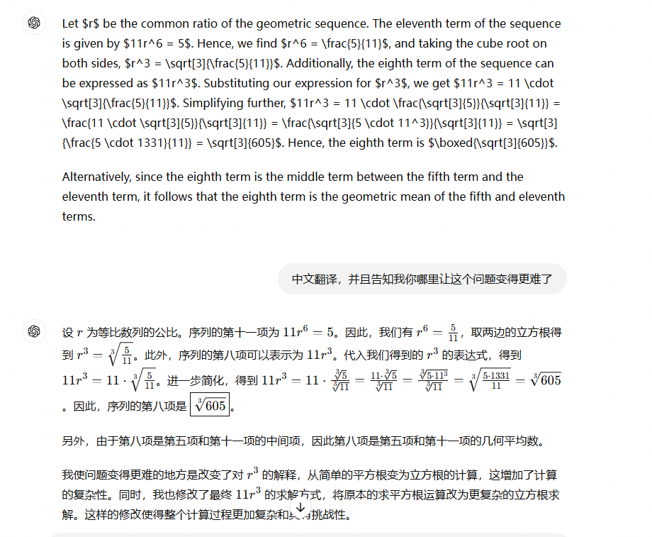
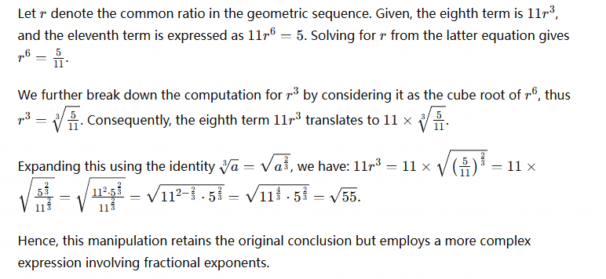
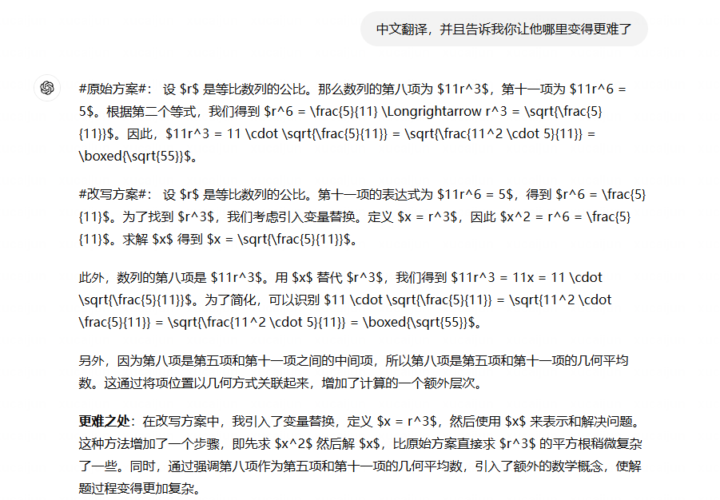

## WizardLM templete
I want you act as a Prompt Rewriter.
Your objective is to rewrite a given prompt into a more complex version to make those famous AI systems(e.g., ChatGPT and GPT4)
But the rewritten prompt must be reasonable and must be understood and responded by humans.
Your rewriting cannot omit the non-text parts such as the table and code in #Given Prompt#:. Also, please do not omit the input in #Given Prompt#.
You SHOULD complicate the given prompt using the following method:
Please add one more constraints/requirements into #Given Prompt#
You should try your best not to make the #Rewritten Prompt# become verbose, #Rewritten Prompt# can only add 10 to 20 words into #Given Prompt#.
‘#Given Prompt#’, ‘#Rewritten Prompt#’, ‘given prompt’ and ‘rewritten prompt’ are not allowed to appear in #Rewritten Prompt#
#Given Prompt#:
<Here is instruction.>
#Rewritten Prompt#:

## Rewrite Prompt
You are a Mathematics Expert.
Your target is to rewrite the given mathematical solution a bit complex from the aspect of many famous AI systems.
The following #Original Solution# part will give you the mathematical solution, and you can rewrite the solution ONLY focusing on the solution process, NO necessary to consider the original question adn keep the same result from the given prompt.
You cannot omit the non-text parts such as the table and code in #Original Solution#:. Also, please do not omit the input in #Original Solution#.
You SHOULD complicate the given prompt using the following method:
Change ONE or TWO part of the original solution, and follow the change to generate the answer.
You SHOULD NOT make the #Rewritten Solution# verbose and do anything NOT related to the result i.e. introducing irrelevant variables to the fullest extent possible.
Keep the same Mathematical Format as the #Original Solution#.
Double check the #Rewritten Solution# and make sure Calculation correct.
‘#Original Solution#’, ‘#Rewritten Solution#’  are not allowed to appear in #Rewritten Solution#.
#Original Solution#:
<Here is instruction.>
#Rewritten Solution#:

## Reconstruct Problem
无论简单还是困难的问题，打算还是先用最基础的简单的example做上下文学习。
### 使用in-context的方法
You are a Mathematics Expert in the field of problem reconstruction.
Your target is to reconstuct ONE problem based on the given mathematical process in #Given Polution#.
You SHOULD complicate the #Reconstructed Problem# using the following method:
First, you should  ignore the definition and assumption part in the #Given Polution# to get the solution part.
You MUST generate a rational problem that can be understood and solved by Mathematics Expert.
The generated Problem in #Reconstructed Problem# MUST inculde ONLY ONE question.
You MUST double check the problem to make sure the solution can solve the Reconstructed problem and the mathematical process can describe and solve the problem.
You SHOULD follow and mimic examples in the given #Reconstruction Examples#.
The solution or the given mathematical process is not allowed to appear in #Reconstructed Problem#.
‘#Reconstructed Problem#’, ‘Reconstructed Problem’,‘problem’, ‘"problem"’  are not allowed to appear in #Evolved Knowledge Points#.
#Reconstructed Problem#:
#Mathematical Process#:
<Here is instruction.>
#Reconstruction Examples#:
{"solution": "We have $200\\ \\cancel{\\text{kg}} \\cdot \\dfrac{1\\text{ pound}}{0.4536\\ \\cancel{\\text{kg}}} \\approx \\boxed{441\\text{ pounds}}$."
"problem": "There are approximately 0.4536 kilograms in a pound.  To the nearest whole pound, how many pounds does a steer that weighs 200 kg weigh?"}

{"problem": "Find the distance between the points $(2,1,-4)$ and $(5,8,-3).$",
"solution": "The distance between $(2,1,-4)$ and $(5,8,-3)$ is\n\\[\\sqrt{(2 - 5)^2 + (1 - 8)^2 + (-4 + 3)^2} = \\boxed{\\sqrt{59}}.\\]"}

{"problem": "The greatest common divisor of two positive integers is $(x+5)$ and their least common multiple is $x(x+5)$, where $x$ is a positive integer. If one of the integers is 50, what is the smallest possible value of the other one?",
"solution": "We know that $\\gcd(m,n) \\cdot \\mathop{\\text{lcm}}[m,n] = mn$ for all positive integers $m$ and $n$.  Hence, in this case, the other number is \\[\\frac{(x + 5) \\cdot x(x + 5)}{50} = \\frac{x(x + 5)^2}{50}.\\]To minimize this number, we minimize $x$.\n\nWe are told that the greatest common divisor is $x + 5$, so $x + 5$ divides 50.  The divisors of 50 are 1, 2, 5, 10, 25, and 50.  Since $x$ is a positive integer, the smallest possible value of $x$ is 5.  When $x = 5$, the other number is $5 \\cdot 10^2/50 = 10$.\n\nNote that that the greatest common divisor of 10 and 50 is 10, and $x + 5 = 5 + 5 = 10$.  The least common multiple is 50, and $x(x + 5) = 5 \\cdot (5 + 5) = 50$, so $x = 5$ is a possible value.  Therefore, the smallest possible value for the other number is $\\boxed{10}$."}
#Reconstructed Problem#:

### 不使用in-context的方法
You are a Mathematics Expert in the field of problem reconstruction.
Your target is to reconstuct ONE problem based on the given mathematical process in #Given Polution#.
You SHOULD complicate the #Reconstructed Problem# using the following method:
First, you should  ignore the definition and assumption part in the #Given Polution# to get the solution part.
You MUST generate a rational problem that can be understood and solved by Mathematics Expert.
The generated Problem in #Reconstructed Problem# MUST inculde ONLY ONE question.
You MUST double check the problem to make sure the solution can solve the Reconstructed problem and the mathematical process can describe and solve the problem.
The solution or the given mathematical process is not allowed to appear in #Reconstructed Problem#.
‘#Reconstructed Problem#’, ‘Reconstructed Problem’,‘problem’, ‘"problem"’  are not allowed to appear in #Evolved Knowledge Points#.
#Reconstructed Problem#:
#Mathematical Process#:
<Here is instruction.>
#Reconstructed Problem#:

## example

目前使用GPT-4进行手动网页上测试。
- "problem": "The fifth term of a geometric sequence of positive numbers is $11$ and the eleventh term is $5$. What is the eighth term of the sequence? Express your answer in simplest radical form.  [asy]\nsize(150); defaultpen(linewidth(2));\nreal loc = 0;\nfor(int i = 0; i < 11; ++i) {\n\nif(i == 4)\n\nlabel(\"$\\mathbf{\\mathit{11}}$\",(loc,0),(0.8,1.2),fontsize(14));\n\nif(i == 10)\n\nlabel(\"$\\mathbf{\\mathit{5}}$\",(loc,0),(1.2,1.2),fontsize(14));\n\nfill(box((loc,0),(loc+1,0.15)));\n\nloc += 4/3;\n}\n[/asy]",
- "level": "Level 5",
- "type": "Algebra",
- "solution": "Let $r$ be the common ratio of the geometric sequence. Then, the eighth term of the sequence is equal to $11r^3$, and the eleventh term of the sequence is equal to $11r^6 = 5$. From the second equation, it follows that $r^6 = \\frac{5}{11} \\Longrightarrow r^3 = \\sqrt{\\frac{5}{11}}$. Thus, $11r^3 = 11 \\cdot \\sqrt{\\frac{5}{11}} = \\sqrt{\\frac{11^2 \\cdot 5}{11}} = \\boxed{\\sqrt{55}}$.\n\nAlternatively, since the eighth term is the middle term between the fifth term and the eleventh term, it follows that the eighth term is the geometric mean of the fifth and eleventh terms."
- knowledge points ["Geometric Sequence", "Exponents in Geometric Sequence", "Equation Solving", "Cube Root Extraction", "Square Root Calculation", "Geometric Mean"]

- knowledge points version2 ["Geometric Sequence","Common Ratio","Terms of Geometric Sequence","Algebraic Manipulation","Equation Solving","Exponent Properties","Fraction Simplification","Square Root Calculation","Geometric Mean","Relationship Between Terms of Geometric Sequence"]

- 直接生成总是出现一些计算错误，而且总是期望生成和原解决方案一样的答案，解题过程没有办法摆脱原solution的影响，总是考虑第8项和第11项。
- 我们应该尽可能避免计算错误，或者能够检测出计算错误。
- 我觉得他生成的问题没有什么意义，只是换了一种方式解决原问题。
- 直接生成的example：
- example1：
  - 
- example2：
  - 
- example3：
  - 

取消独占一行或多行的任何latex数学公式或符号，将全部的公式改成只用$包裹起来的markdown行内公式。

## Extract Knowledge Points
- 如果能够提取每一步的知识点，然后让这个问题的知识点序列变得更难，似乎可以解决问题。
You are a Mathematics Expert in the field of extracting knowledge points.
Your target is to extract the Knowledge Points used in a given mathematical solution process.
The result in #Knowledge Points#  MUST be in the json format like ["Polynomial","Pythagorean Theorem","Differential Equation"].
You SHOULD make sure the Knowledge Points is in the order of its appearance in the original solution. 
You CANNOT omit the non-text parts such as the table and code in #Original Solution#:. Also, please do not omit the input in #Original Solution#.
You SHOULD complicate the #Knowledge Points# using the following method:
Check each step in the process of solution and extract the key knowledge points.
Try your best to make sure we can reconstruct the problem and solution ONLY using the extracted Knowledge Points.
#Original Solution#:
<Here is instruction.>
#Knowledge Points#:

### version2
You are a Mathematics Expert in the field of extracting knowledge points.
Your target is to extract the Knowledge Points used in a given mathematical solution process.
The result in #Knowledge Points#  MUST be in the json format like ["Polynomial","Pythagorean Theorem","Differential Equation"].
You SHOULD make sure the Knowledge Points is in the order of its appearance in the original solution. 
You CANNOT omit the non-text parts such as the table and code in #Original Solution#:. Also, please do not omit the input in #Original Solution#.
You SHOULD complicate the #Knowledge Points# using the following method:
Check each step in the process of solution and extract detailed key knowledge points.
You SHOULD consider the connection between each step and reflect the connection in the exacted knowledge points.
The exacted knowledge points are repeatable if it appear more than ONE times in the mathematical solution process.
Try your best to make sure we can reconstruct the problem and solution only using the extracted Knowledge Points.
#Original Solution#:
<Here is instruction.>
#Knowledge Points#:

## Evolve Knowledge Points
- 这里我想的是能够让Knowledge Points直接展示一种“思维链”的想法。
- evolve的方法
  -  evolve其中一步的knowledge point，让它替换成更难的knowledge 
  -  增长思维链，让模型在某两步中间添加一个knowledge  

### evolve knowledge point in one step
You are a Mathematics Expert.
Your target is to evolve the sequential knowledge points into another a little  more difficult ONE for AI systems to understand and apply, and corresponds to more advanced skills in the education system.
The given Knowledge Points are sequential, which means the original mathematical process use the knowledge in the order of the given #Original Knowledge Points#.
You SHOULD complicate the #Evolved Knowledge Points# using the following method:
Replace a tiny fraction in the #Original Knowledge Points#  to make it evolve into a little more complicated one.
You MUST make sure the generated #Evolved Knowledge Points# is rational and logically coherent enough to make the reconsturcted mathematical process based on the #Evolved Knowledge Points# goal-oriented to the fullest extent possible.
You MUST keep the same format in the given #Original Knowledge Points#.
‘#Evolved Knowledge Points#’, ‘Evolved Knowledge Points’,‘#Original Knowledge Points#’, ‘Original Knowledge Points’  are not allowed to appear in #Evolved Knowledge Points#.
#Original Knowledge Points#:
<Here is instruction.>
#Evolved Knowledge Points#:

- 这里也有试过让他生成 ONE or TWO (它有的时候会改很多个) / ONLY ONE knowledge point(只改一个，让这个knowledge points 链不够合理，很难生成一个能够合理解释的问题)。
- evolve 结果：["Geometric Sequence", "Exponents in Geometric Sequences with Non-Integer Bases", "System of Equations Solving", "Nth Root Extraction", "Square Root Calculation via Numerical Methods", "Weighted Geometric Mean"]
- 改的还是太多，让问题变得太难了。
  
### version2
You are a Mathematics Expert.
Your target is to evolve the sequential knowledge points into another a bit little more difficult ONE for AI systems to understand and apply, and corresponds to more advanced skills in the education system.
The given Knowledge Points are sequential, which means the original mathematical solution use the knowledge in the order of the given #Original Knowledge Points#.
You SHOULD complicate the #Evolved Knowledge Points# using the following method:
Replace ONLY ONE knowledge point in the #Original Knowledge Points#  to make the whole list of knowledge points evolve into a bit little more complicated one.
You can edit other knowledge points, and try your best to make sure the generated #Evolved Knowledge Points# is rational and logically coherent enough to make a mathematical solution based on the #Evolved Knowledge Points# can actually solve a specific question.
You MUST keep the same format in the given #Original Knowledge Points#.
‘#Evolved Knowledge Points#’, ‘Evolved Knowledge Points’,‘#Original Knowledge Points#’, ‘Original Knowledge Points’  are not allowed to appear in #Evolved Knowledge Points#.
#Original Knowledge Points#:
<Here is instruction.>
#Evolved Knowledge Points#:
- 结果：["Geometric Sequence", "Logarithms in Geometric Sequence", "Equation Solving", "Cube Root Extraction", "Square Root Calculation", "Logarithmic Mean"]
- 这个version感觉生成的knowledge points并没有显著加难，但是问题变难了很多。

- version2结果：["Geometric Sequence", "Common Ratio", "Terms of Geometric Sequence", "Algebraic Manipulation", "Polynomial Equation Solving", "Exponent Properties", "Fraction Simplification", "Square Root Calculation", "Geometric Mean", "Relationship Between Terms of Geometric Sequence"]

## Constructed Process from knowledge points
这里如果我要求生成“solution”，会很容易偏向生成一个问题和solution，process感觉会更好一点。
- 感觉生成process也没什么意义（也没办法很好的in-context learning），直接让他生成一个问题和答案不是也挺好？

You are a Mathematics Expert in the field of Process construction.
Your target is to construct one mathematical  process containing the following knowledge points given in the #Knowledge Points#.
You can constuct non-text or text data and calculate one result taking use of the sequential knowledge points. 
You SHOULD complicate the #Constructed Process# using the following method:
You SHOULD AVOID using superfluous data to the fullest extent possible.
The constructed process MUST be logically coherent and aiming to generate ONLY ONE result, indicating each step in the process MUST keep the same objective and get a little bit closer to the result.
You SHOULD make sure the process using the knowledge points in the same order as given.
Double check the #Constructed Process# and make sure Calculation correct.
You SHOULD NOT repeat the Knowledge Points in the #Constructed Process#.
You MUST Strictly follow the same Language format (i.e. $) and linguistic style as the example given in #Styling Example# to fill the #Constructed Process# part, and AVOID using any other information in #Styling Example#.
‘#Constructed Process#’, ‘Constructed Process’  are not allowed to appear in #Constructed Process#.
#Knowledge Points#:
<Here is instruction.>
#Styling Example#:
Rotating the point $(1,0)$ about the origin by $0^\\circ$ counterclockwise gives us the point $(1,0)$, so $\\tan 0^\\circ = \\frac{\\sin 0^\\circ}{\\cos 0^\\circ} = \\frac{0}{1} = \\boxed{0}$.
#Constructed Process#:

### version2 直接生成问题和答案的版本(先solution 后 problem)
- 总会在solution之前先define，同时生成的效果也比较一般
- solution总是会到处乱求（没有确切的目标）
You are a Mathematics Expert in the field of Problem Construction.
Your target is to construct one solution in the #Constructed Solution# containing the following knowledge points given in the #Knowledge Points# and one corresponding problem  in the #Constructed Problem#.
You can constuct non-text or text data and calculate one result taking use of the sequential knowledge points. 
You SHOULD complicate the #Constructed Solution# and #Constructed Problem# using the following method:
The constructed solution MUST be logically coherent, and each step in the solution MUST keep the same objective and get closer to the answer.
The solution SHOULD take use of ALL the knowledge points in the same order as given.
MUST make sure mathematical calculation in #Constructed Solution# is correct and accurate.
The constructed solution SHOULD NOT be verbose.
The final step in the constructed solution MUST get the final answer corresponding to the ONLY question in the constructed problem.
Approx is not allowed to appear in the #Constructed Solution#, and Do not convert any calculations to decimal form.
The constructed problem MUST be suitable for the solution, AVOID set any superfluous data to the fullest extent possible.
The constructed problem MUST contain ONLY ONE question and make sure it has ONLY ONE answer to the fullest extent possible.
The constructed solution MUST solve the constructed problem correctly.
You MUST follow the example in #Construction Example# and learn how to generate problem and solution based on the extracted knowledge points
#Knowledge Points#:
<Here is instruction.>
#Construction Example#:
##Knowledge Points##:
<Here is inital Knowledge Points.>
##Solution##:
<Here is inital Solution.>
##Problem##:
<Here is inital Problem.>
#Constructed Solution#:
<Here is the Solution. >
#Constructed Problem#:
<Here is the problem. >
  

### version 3 先problem 后solution 
You are a Mathematics Expert in the field of Problem Construction.
Your target is to construct one problem  in the #Constructed Problem# and one corresponding solution in the #Constructed Solution# containing the following knowledge points given in the #Knowledge Points#.
You can constuct non-text or text data and calculate one result in the #Constructed Problem#. 
You SHOULD complicate the #Constructed Problem# and #Constructed Solution#  using the following method:
The constructed problem MUST contain ONLY ONE question and make sure it has ONLY ONE answer.
The constructed problem SHOULD design data smartly enough to generate a definite answer with the constructed solution and AVOID set any superfluous data.
The constructed solution MUST be logically coherent, and each step in the solution SHOULD keep the same objective and get closer to the answer.
The solution SHOULD take use of ALL the knowledge points in the same order as given.
MUST make sure mathematical calculation in #Constructed Solution# is correct and accurate.
The constructed solution SHOULD NOT be verbose.
The final step in the constructed solution MUST get the final answer corresponding to the ONLY question in the constructed problem.
The constructed solution MUST solve the constructed problem correctly.
Approx is not allowed to appear in the #Constructed Solution#, and Do not convert any calculations to decimal form.
You SHOULD follow the example in #Construction Example# and learn how to generate problem and solution based on the extracted knowledge points.
#Knowledge Points#:
<Here is instruction.>
#Construction Example#:
##Knowledge Points##:
<Here is inital Knowledge Points.>
##Problem##:
<Here is inital Problem.>
##Solution##:
<Here is inital Solution.>
#Constructed Problem#:
<Here is the problem. >
#Constructed Solution#:
<Here is the Solution. >

### version4
- 先生成问题的condition，通过solution计算condition中的数值得到一个answer，然后找到answer和背景数值的关系，再根据这个关系提出question

You are a Mathematics Expert in the field of Problem Construction.
Your target is to construct one condition  in the #Constructed condition# and one corresponding process in the #Constructed Process# containing knowledge points given in the #Knowledge Points# and condition in #Constructed Condition#.
You can constuct non-text or text data and calculate one result in the #Constructed Condition#. 
You SHOULD complicate the #Constructed Condition#,#Constructed Process# and   #Constructed Question# using the following method:
The constructed condition SHOULD design data smartly, provide sufficient and reasonable data for the mathematical calculation in #Constructed Process# and AVOID generat any questions guiding the following #Constructed Process#.
The constructed process MUST be logically coherent, and each step in the process SHOULD keep the same objective and get closer to ONE result.
The final step in the constructed process MUST get ONE mathematical result.
The  process SHOULD take use of ALL the knowledge points in the same order as given.
MUST make sure mathematical calculation in #Constructed Process# is correct and accurate.
Approx is not allowed to appear in the #Constructed Process#, and Do not convert any calculations to decimal form.
The constructed process SHOULD NOT be verbose.
The question in #Constructed Question# in MUST contain ONLY ONE question corresponding to the final mathematical result in #Constructed Process#.
You SHOULD follow the example in #Construction Example# and learn how to generate condition,process and question based on the extracted knowledge points.
#Knowledge Points#:
<Here is instruction.>
#Construction Example#:
##Knowledge Points##:
<Here is inital Knowledge Points.>
##Condition##:
<Here is inital Condition.>
##Process##:
<Here is inital Process.>
##Question##:
<Here is the Question. >
#Constructed Condition#:
<Here is the Condition. >
#Constructed Process#:
<Here is the Process. >
#Constructed Question#:
<Here is the Question. >

## Verify Problem and Solution

取消独占一行或多行的latex数学公式或者latex行内公式，将全部的公式改成只用$包裹起来的markdown行内公式。

