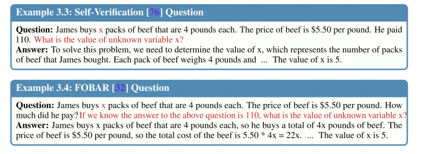

# Abstract
大语言模型在数学问题方面不够好（由于推理过程复杂）。
重写问题然后生成了MetaMathQA数据集，在该数据集上微调LLaMA-2，实现了性能的提高，并且比其他模型更好。

# Introduction

- 基于prompt的方法：不修改模型参数，选择合适的提示输入，激活大模型的潜在能力。
- 基于fine-tune的方法：在一些更强大的大模型的指导下更新开源LLM。严重依赖于数据。

期望在向前推理和向后推离方向上引导问题。
扩大问题的多样性

# Method
## Answer 加强
把普通的Answer改成带有思维链的Answer，原问题不变。

## 改写问题
改写问题的措辞，然后再用few-shot的方式生成答案，收集对的答案作为训练数据集。

## 逆向推理问题
现在的方法（SFT、RFT、WizardMath）在逆向推理问题上表现不好。
先把问题中的数字进行随机掩码。
- Self-Verification，直接把问题改成称述句，然后问x值。
- FOBAR，问题原封不动，加一句知道问题的答案是多少，然后问x值。
  
把四种数据集并起来得到MetaMath数据集。

# 实验
把GSM8K和MATH数据集上的增强后的数据作为数据集，主实验在原数据集上（GSM8K和MATH）效果很好。

做了消融实验，用embedding的差的模长作为多样性的衡量。

实验中对带有错误答案的增广数据进行微调的模型仍然优于SFT。

合并自己的数据集和别人的数据集会损失性能，所以more data is not always better。

