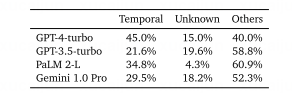

Premise顺序在prompt中和与真实值证明以相同的顺序呈现，会大大提高模型的准确率。

当prompt中出现不相关的前提（得出结论用不到的前提时）排序效应会进一步放大。

错误分析：最常见的两种常见问题是
- 1.忽视时间顺序，盲目的按照给定顺序使用变量。
- 2.按顺序处理问题时没有指定某些数量时，他会引入未知变量进行计算。

# related work
## 忠实模型
Shi等人表明在问题陈述中包含不相关的上下文会导致其他推理基准上的性能大幅下降。

逆转诅咒，识别“A是B”的大语言模型不一定知道“B是A”。

lost-in-the-middle现象，长上下文场景中，当解决人物的相关信息放在开头或结尾时，大语言模型性能最好。

Yan等人推出了一种演绎推理方法，链接问题中的事实和规则生成有向图，再调用大语言模型在解决问题之前对上下文进行修剪和排序。
## 语言模型的顺序影响。
单词在随机排列后，模型通常保持合理的性能。

