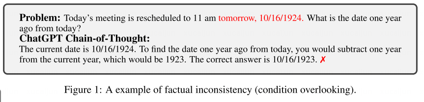
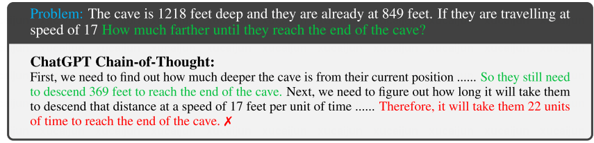
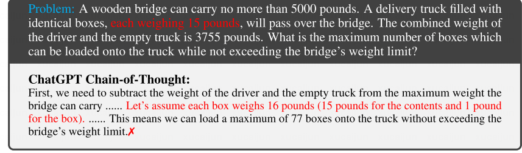
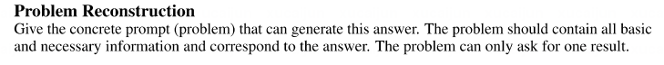
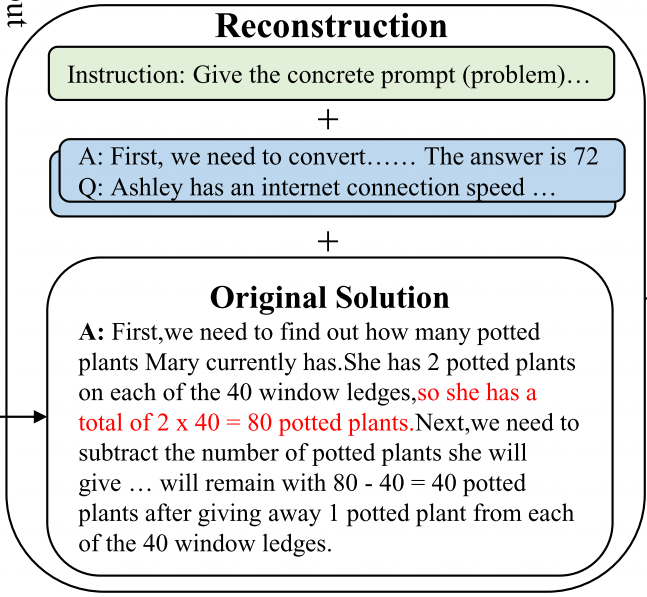
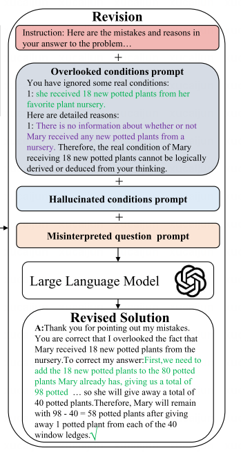
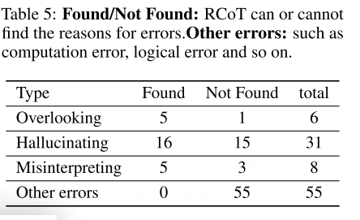

# Abstract
RCOT(Reverse Chain of Thought)
在数学计算数据集上比标准CoT和自一致性、自改进模型有所提高。

# Introduction
之前研究缺乏对于思维链事实不一致问题的明确研究，没有给出细粒度的反馈。
可以解决三种问题：
- overlooking

- misinterpreting
 
- hallucinating

方法从原始解决方案重构新问题，同时对重构后的问题和原始问题进行比较来检测不一致性，监测到的不一致被制定为细粒度的反馈，指导大模型修改他们的方案。

贡献：
- 提出了RCOT，能够检测和纠正在数学计算上推理。
- RCOT的反馈比标准COT有提高，但人工编写的真实值反馈可以进一步提高推理能力。
- 提供了可解释性。

# Related Work
Prompt Engineering两个代表性例子就是 In-Context Learning和Chain-of-Thought

# Reversing chain-of-thought
## Problem reconstruction
手动编写指令和上下文示例作为reconstruction prompt。

这里可以看出来其实answer就是有思维链的，但只运用了Q和A。是否可以设计一些指导模型如何一步步进行逆向思维的上下文例子？（更加细粒度）

## 细粒度比较
要求大模型直接比较重构问题和原始问题不太能产生高质量的检测结果。
- 问题分解，要求大语言模型把非结构化的文本（两个问题），转化成一个条件列表。
- 条件比较 对于原始问题和重构问题中的每个条件，都看能否通过另一方的条件列表推断出来。这里对应者overlooking和幻觉。
- 问题比较，直接比较重构问题和原始问题他们提出的具体疑问，如果不一样认为出现了misinterpreting。
  
## 细粒度反馈和修正
如果没有检测到两个问题有任何不一致，就判定原始解决方案是正确的。
否则，就需要指定细粒度的反馈，指导大模型修改其解决方案。reason是比较时让大模型给出的。
- 首先声明解决方案不对
- 列出检测到的实际不一致
- 让大模型修正他的solution

# Experiment
对于两种COT（zero-shot 和 few-shot）在两种模型（ChatGPT、LLaMA）上进行改进，比原本的模型更强、和一些更强baseline比性能差不多 tokens消耗更少。

## 消融实验
- w/o reasons 没有告诉模型检测的事实不一致性，而是只给出了一个更层次的判断“你的答案是错的”。
- w/o judgment+reasons 无论正确与否，只告诉他要“double-check your answer”
都有性能下降。

如果直接使用粗粒度的比较，甚至会导致模型比标准CoT更差。

## 额外的定量分析

