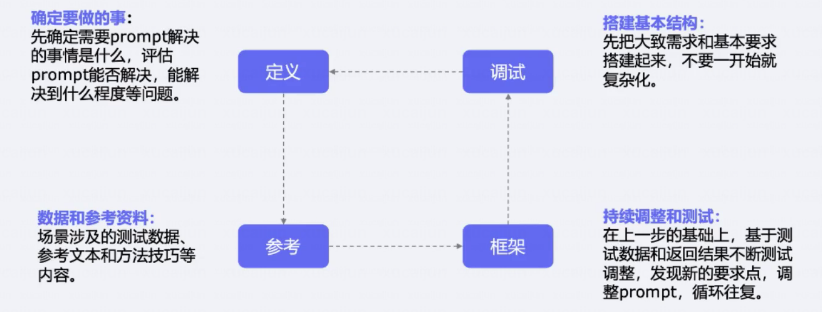

# 如何用大模型做好科研？
## 学术科研中的典型场景
- 科研论文写作
    - 论文内容生成
    - 论文语言润色
    - 跨学科融合/构思
- 数据抽取与决策
    - 内容搜索+总结
    - 文献相关性分析
- 论文阅读、总结
    - 知识点抽取

- 创造性任务：启发性构思+promopt
- 机械性任务：总结prompt+批量调用API

## 如何写好一个prompt
- 角色设定：你是一个xxx。你具有xxx技能...
- 背景：准备做什么事
- 任务目标
- 任务要求
- 任务数据

### 框架1
- instrcution 指令，具体任务
- Context 背景信息、上下文
- Input Data 输入数据
- Output Indicator 输出格式

### 框架2
- Capacity and Role 希望模型扮演怎样的角色
- Insight 背景信息和上下文
- Statement 指令，希望模型做什么（输出格式、思维链）
- Personailty 个性，希望模型以什么方式回答
- Experiment 要求模型提供多个答案

### 少样本（few-shot）
### 思维链
可以告诉模型分析的思路

## 参数控制
temperature 和 top_p 参数，调整稳定性、多样性

## 调用API
- 注册账号API Key
- 设置调用代码，参考文档即可

## 应用演示
- aminer.cn 基于学术、论文的应用
- bigmodel模型平台，适用于API调用