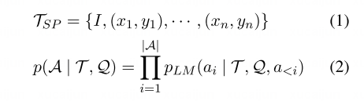

# Abstract
思维链prompt显著提高了大预言模型的推理能力。

https://github.com/zchuz/CoT-Reasoning-Survey.
# Introduction
CoT在复杂任务中表现得更好。
CoT不是直接提供答案，而是分解成推理步骤，在推理步骤之间创建链接，并且增加最终答案的可信度和可解释性。

本文中深入研究了更广阔范围中的思维链推理，广义思维链 generalized chain-of-thought（XoT）
就是通过一步一步的推理方法逐步解开复杂的问题。

- 综合调查
- 细致分类
- 前沿和未来
- 公开资源

# Background and Preliminary
LM出现新功能：上下文学习和思维链推理，预训练后prompt逐渐取代预训练后微调

- 少样本学习  
    - question Q，prediction A，prompt设计 T
    - 传统结构
    
    
    - CoT结构 在例子中就给出根据（rationales ei），生成时也要生成对应的R
    
    

- CoT的好处
    - 增强推理
    - 提供可解释性
    - 推进协作，促进用户-系统交互，允许改变模型的执行轨迹

# Benchmarks
各种方面的不同dataset作为benchmark

数学、常识、符号、逻辑和多模态推理
# Advanced Methods

## XoT Prompt Construction
### 人工 Prompt
手动标注自然语言，形成理论根据来指导模型进行逐步推理（few-shot 学习）。也有工作（PAL、MathPrompter、NLEP）利用编程语言形式的rationale

手工XoT有更好的性能，但是rationle的生成有显著的成本增加，demonstration select也是一个问题。（如何选择比较好的rationles）

### 自动 Prompt
1.设计特定的指令来刺激zero-shot的CoT推理，（在问题之后添加 Let's think step by step），也有一些类型的指令，包括让模型编写程序来解决问题、推理之前起草计划、角色扮演。
这种方法缺少明确的示范指导，不够稳定。

2.另一种方法是基于自动生成的推理依据来进行few-shot学习，这些方法应该是可以自动化生成很多rationales，但是重点就在于如何选择适当的演示。
这里有一些对于rationales的度量方法，通过聚类、对问题的模式构建演示、使用Gibbs抽样迭代选择demostrations。

### 半自动 Prompt
在自动XoT的基础上，结合少量人工注释的rationales来获得受监督的信号。
应该就是通过人工的方式（机器学习？）尝试获得高质量的rationales，并且选择适当的演示来促进思维链的形成。

一些工作尝试生成更高质量的rationales（这里需要查看一下这里的论文体会一下和自动Prompt的区别），另一些论文尝试在这些rationales选择一些更好的demostrations。

### 三种放的优缺点
- 人工方式依赖于高质量的rationales，人工成本高、领域迁移困难
- 自动方式不需要人工成本，而且方便迁移，但是缺乏监督信号，有误差和不稳定性
- 半自动化实现了两者的平衡，更适用于下游应用

## XoT的拓扑变体

### 链式结构
有使用编程语言、使用逻辑推理语言，这些方法分离了thought generation 和 execution（模型只需要专注于生成正确的代码，而不需要在内部执行推理、执行？），减少了inconsistency reasoning errors（推理路径在逻辑上缺乏一致性）
同时这种方法提供了一种高阶的全局框架，而不是专注于细节。

### 树形结构 ---理解不够好
结合树形结构和搜索算法，模型有探索和回溯的能力。有方法探索和评估多个 tree of thoughts、有方法引入蒙特卡洛dropout和生成似然的不确定性度量（？），对中间推理过程提供了更准确的评估。

树形结构的思维链方法由于需要对问题进行显式的问题分解和状态转移，但由于不同问题的分解不同，任务泛化的局限性很大。

### 图形结构 ---理解不够好
引入了环路，在处理复杂问题上优于基于树的方法，但是依赖于特殊设计的状态分解，泛化能力比较差。

复杂结构有利于解决更困难的问题，但是也限制了这些方法的普遍应用。

## XoT 增强方法
### 验证和改进

大模型倾向于产生幻觉 
- 忠实性错误（faithful）：模型的推理过程与答案不一致出现与事实不符，
- 事实性错误（factual）：模型提供的信息与客观事实不符

结合验证和改进减轻忠实性错误。

- 改进 使用大模型提供的反馈，改进reasoning。有利用 feedback from itself 去迭代的自改进。但大模型可能无法解决超出自身能力的问题，有工作引入外部反馈或者对改进后的推理进行二次验证。

- 验证 logical reasoning structures 适合用于验证。这里提到的论文多数用了很多不同的方案验证推理过程的正确与否。
    - 反向推理（backward reasoning）发现推理中的不一致方面，从而重构问题中的条件或者变量，**这里的论文应该更多看一下**。可以从中学习一下别人是如何这样反向进行重构问题的，我们多一步骤就是变化我们的答案。
  
这个方面主要的问题就是反馈信号的采集存在很多不足（很难给出一个很好量化、或者说很好指导的feedback）

### 问题分解

有一些任务直接分解成直接的子问题，逐步解决子问题来解决复杂的问题

L2M以自上而下的方式将问题分解为子问题，一次解决一个子问题，用子问题的解决方案促进后续子问题的解决。迭代分解
有工作把问题分解成一个有向无环图，基于图的依赖关系逐步推理。
通过监督训练获得专门的分解器，有的工作也涉及到分解问题和表格。
也有自底向上的聚合方式。

这些方法都依赖于正确的问题划分，不一致的划分可能会导致更差的结果。

### 知识增强

引入外部指数或者挖掘模型的内部知识。

有的方法prompt模型去输出他的参数化知识（内部知识），并且在此基础之上进行推理。
prompt模型对其知识进行规划推理，得出更一般的结论。
采用强化学习来以知识为基础的推理。
利用模型的推理轨迹构建记忆库，需要时选择相关的demostrations。

外部知识往往更加可靠，利用知识库、对检索知识的验证、分解问题并且迭代的使用子问题检索。

## self-ensemble（自集成）

大语言模型生成过程中有sample的步骤（即存在不同的回答），创造了自集成（生成多组答案之后再得到最终答案）的可能性。

有训练一个验证者模型对答案排序、对多个样本的答案执行多数投票等方案。

这样的方案没有考虑推理过程，也可以在步骤级别对集成进行改进、分层答案聚合、集成不同的XoT变体。多智能体辩论

这是简单而有效的手段，但推理成本高。

## 高效推理
大模型推理方面比较低效，有分解问题并且同时处理、生成草稿并且在推理过程中跳过中间层、一些步骤用更小的模型等方法降低推理成本。

# 研究前沿
## Tool Use
一些工作赋予了大模型使用外部工具的能力，能够与（多模态的）外部环境进行交互。（这也可以构成XoT的一部分）

这些问题在促进多个工具的调用和纠正查询错误方面存在局限性。
## Planning
对于复杂任务，我们应该planning 来把他们分解成子任务。plans可以用代码或者其他定义好的语言来描述。

有任务生成Python代码来控制agent，迭代完善计划。
有任务利用特殊的语言（PDDL）分解复杂问题。

上述是预先定义的计划，可以使用搜索算法来动态规划和探索空间。Tree-of-Thought（树形结构）通过DFS或者BFS来探索问题，跟踪和更新中间状态。
有任务通过蒙特卡洛书搜索或者启发式A*搜索来进行探索。

## 推理能力的蒸馏
采用自蒸馏的方法进行自我改进？

CoT主要出现在大语言模型中，小型语言模型使用有限。对CoT推理数据进行微调，较小的模型也能表现出逐步推理的能力。之后的很多任务都尝试将大模型的逐步推理能力蒸馏进更小的模型中。

最近的研究发现，对偏好数据（关于不同推理路径或结果的排序、比较或者评分？）的优化可以进一步提高小模型的推理能力。

代码是推理的优秀的中间表示，也可以将程序辅助的推理能力蒸馏到更小的模型中。

这些研究都是从有优秀推理能力的较大模型中蒸馏出具有推理链的较小模型。

# 未来方向
## 多模态推理
有一些关键挑战
- 视觉文本的交互，有效整合视觉和文本特征
- 利用vllm，即将推理技术更好的运用在多模态领域
- 视频推理，如何扩展到具有复杂时间依赖性的视频推理。
## 忠实性推理
factual错误常见方法是检索增强（RAG），而忠实性错误更难识别。
- 检测，如何识别 不忠实的推理
- 纠正 如何获得精准的反馈，并且在这个基础上进行正确的改进
## 理论层面
CoT背后的机制还没有得到明确的解释，可以继续探讨一下。

目前对于CoT理论的探索还局限于表面
- 涌现能力是如何产生的（规模达到一定程度后，会自发地展现出一些在小规模模型中未曾出现或无法实现的新功能和行为）
- CoT通过何种方式强于了普通的few-shot学习