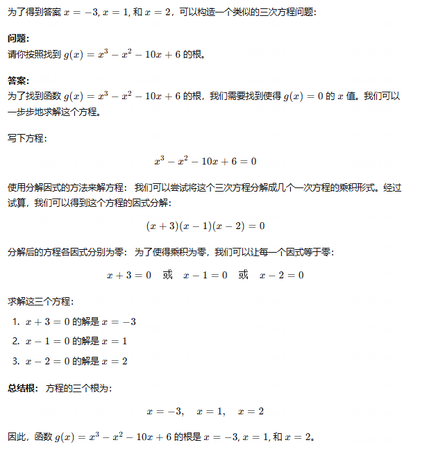

这样感觉上来说就不太好，“答案更难”其实并不一定意味着问题变得更难。应该考虑在让答案从什么角度变得更难，或者怎么样更好的指导模型生成更难的问题。

- 增加答案的本身维度，x=1，x=-3 去增加一个维度。
- 给答案增加限定，即原本答案是 x=1，改成 a<0时答案为 1，a>0时答案为 2。
- 给答案增加一个维度，原本答案是 x=1，改成 x=1，y=2。
- 修改答案的形式？整数改小数、分数、无理数。
  
- 改变推理中使用的方法，原本使用加减乘除，改成用积分微分。（让大模型抽取每个步骤的知识点，然后将一些步骤改成更难的知识点？但怎么样去生成问题和答案还没有考虑清楚）
- 增加推理链的长度？
  

这里是告知了模型原本的思维链推到的答案，和我们修改后的答案。所以如果不给出思维链的话生成的问题质量可能会比较差，因为答案的复杂度和问题并没有强关联。

相当于是
F(原本的思维链和答案，原本的问题，修改后的答案)= 修改后的问题

从小的层面来说，原本的思维链和答案  and 原本的问题，自然而然的构成了一个In-context learning，但也可以从大的层面，即“F(原本的思维链和答案，原本的问题，修改后的答案)= 修改后的问题” 这个角度构建一些few-shot。

但这种方式会更加限定问题的形式，但也许可以作为方法的一部分。

这样对于模型来说是逆向推导，但是可以正向去验证。（从MetaMath的实验来说，没有微调的大语言模型在正向推导表现应该会明显好。）所以也可以再设计一个模块再verify一下这个问题？
有正向验证应该能保证我们的数据集中的答案的正确性，可以预料大模型在复杂问题（推导过程长的问题）正确率会低。（正向和反向的自一致性）

看过的有逆向推导的三篇文章都集中在数学领域。（RCOT、FOBAR、MetaMath）

从policy model生成的错误答案再去衍生答案，会不会变得很奇怪，让模型学到一些错误的思维链推导？有一些数据集本身就是带思维链的，直接从别人的答案上进行修改效果会好一些吗？

只从预测正确的进行学习，或者让更强的模型去修改它预测错误的？

或者直接用更强的模型直接对接问题x？

我们的方法比起直接生成问题再回答有什么好处？1.正确率更高。2.也许可以考虑让问题更加具有多样性，因为从答案去发散问题感觉上来说是更多样性的。如果答案带有思维链的话感觉会比较固定。
